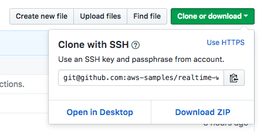
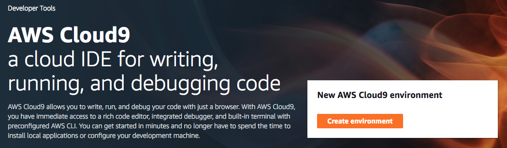
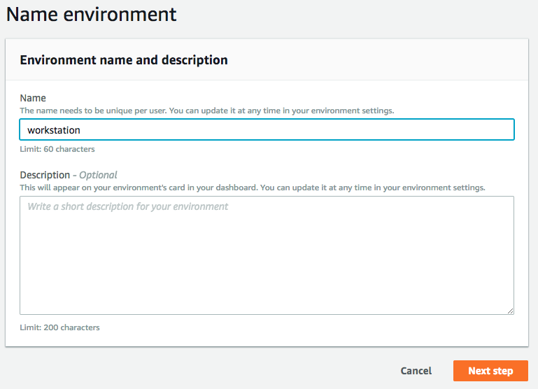
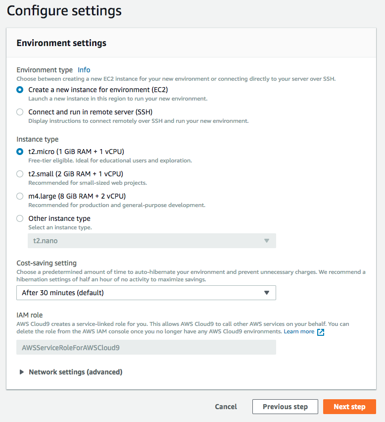
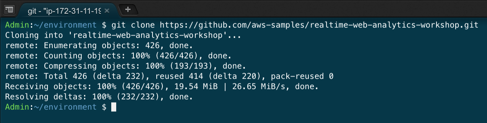

# AWS Realtime Web Analytics Workshop

## Introduction

Knowing what users are doing on your web sites in realtime gives you insights you can act on without having to wait for delayed batch processing of clickstream data.  There are many use cases for evaluating web traffic analytics in realtime.  Watching the immediate impact to user behavior after new releases, detecting and responding to anomalies, situational awareness, and evaluating trends are all benefits of having realtime web site analytics.

In this workshop we will build a cost optimized platform to capture web beacon traffic, analyze the traffic for interesting metrics, and display it on a customized dashboard.

<strong>Note: You are responsible for the cost of AWS services used while running this workshop.  Expand for details.</strong>

You are responsible for the cost of the AWS services used while running this reference deployment. As of the date of publication, the baseline cost for running this solution with default settings in the US East (N. Virginia) Region is approximately $100 per month. This cost estimate assumes the solution will record 1 million events per day with an average size of one kilobyte per event. Note that the monthly cost will vary depending on the number of events the solution processes. For 10 million events per day, the cost is approximately $170 per month. For 100 million events per day, the cost is approximately $950 per month. Prices are subject to change. For full details, see the pricing webpage for each AWS service you will be using in this solution.

 

To get started with this fun and educational workshop, simply clone this repository and start on module 1 below:

**Note:**  If you don't have python or git installed on your computer, I recommend that you use an [AWS Cloud9](https://aws.amazon.com/cloud9/) environment to clone the repository, as well as run the python scripts that are part of this workshop.  Expand the instructions below for details:

<strong>Cloud9 Environment Setup (expand for details)</strong>

### AWS Cloud9 Environment Setup Instructions

1.  Navigate in the AWS console to **Services**, then select **Cloud9**.  Be sure that you have either the **US East (N. Virginia)** or the **US West (Oregon)** region selected before you proceed to the next step.
2.  Click the **Create Environment** button:

3.  Give your Environment a name, then click the **Next step** button:

4.  The default Environment settings should be fine for this workshop (t2.micro instance type), which will allow you to stay within the free tier for your Cloud9 environment usage.  If you want to load test the solution from this environment, you may want to provision a larger instance type to increase the network bandwidth available to your environment:

5.  Review the Environment name and settings, then click the **Create environment** button to continue:

6.  Once your environment has started, you can open a Terminal to run the git clone command:

`git clone https://github.com/aws-samples/realtime-web-analytics-workshop.git`

7.  You're now ready to proceed with Module 1.  Use the Cloud9 Environment whenever you need to access any of the artifacts from the workshop git repository or run the python scripts.

**Note:**  The Cloud9 Environment will automatically turn off after being idle for 30 minutes, so you might need to restart it by accessing it through the AWS console.

## Module 1 – Capturing Realtime Clickstream Events from Web Servers

In this module, you will start with an AutoScaling Group of Apache web servers, representing the front-end of your existing website or application.  The AutoScaling Group receives incoming connections from an Application Load Balancer, and is configured to automatically scale out (and back in) based on the amount of incoming network traffic received by the web servers:

You will then create an S3 analytics bucket that will store an archive of all the clickstream events for historical analysis, and create a Kinesis Firehose delivery stream that will deliver messages to the S3 analytics bucket.  You'll add a Kinesis agent to the fleet of web servers and configure it to send messages that appear in the Apache access logs to the Kinesis Firehose delivery stream: 

In this scenario, you will leverage Amazon S3, Amazon EC2 Linux Instances, AutoScaling, Amazon Kinesis Data Firehose, and CloudFormation to automate the initial deployment, as well as changes to the stack.

**Note:**  The AWS services you use to complete this workshop will cost a small 

[Get Started on Module 1](module-1/README.md)

## Module 2 – Performing Realtime Analytics with Amazon Kinesis Data Analytics

Amazon Kinesis Data Analyitics makes it easy to process streaming data in real time with standard SQL.  In this module you will create a Kinesis analytics application and use SQL on streaming data to generate metrics in real time that provide insights into current activies on your web site.  Those metrics will be normaized and emitted to a Lambda function which delivers the data to a DynamoDB table.  

In this scenario, you will leverage Amazon Kinesis Data Analytics, AWS Lambda, and Amazon DynamoDB.

[Get Started on Module 2](module-2/README.md)

## Module 3 - Visualizing Metrics using CloudWatch Dashboards

In this module, which builds on our previous modules, you will start with realtime metric data that is being inserted into a DynamoDB table by our Kinesis Data Analytics application:

You'll learn how to capture the table activity with [DynamoDB Streams](https://docs.aws.amazon.com/amazondynamodb/latest/developerguide/Streams.html).  Once the stream has been created, you'll create a Lambda function that subscribes to the DynamoDB stream and processes the data change events, publishing them as [CloudWatch Metrics](https://docs.aws.amazon.com/AmazonCloudWatch/latest/monitoring/working_with_metrics.html) using [PutMetricData](https://docs.aws.amazon.com/AmazonCloudWatch/latest/APIReference/API_PutMetricData.html).  Finally, after the CloudWatch Metrics are published, we'll visualize the data by creating a [CloudWatch Dashboard](https://docs.aws.amazon.com/AmazonCloudWatch/latest/monitoring/CloudWatch_Dashboards.html).

In this scenario, you will leverage Amazon DynamoDB Streams, AWS Lambda, Amazon CloudWatch Metrics and Dashboards.

[Get Started on Module 3](module-3/README.md)

## Module 4 - Adding Custom Metrics and Extending the Solution

In this module you will extend the solution to include a custom metric not already provided by default.   

[Get Started on Module 4](module-4/README.md)

## License Summary

This sample code is made available under a modified MIT license. See the LICENSE file.
