#  Configure Kinesis Analytics to Process Clickstream Data

## Introduction

In this module, you will use CloudFormation to add a Kinesis Analytics application, a Kinesis Data stream, a Lambda function, and two DynamoDB tables.  You will first start the Kinesis Analytics application, update the SQL, and set the data stream as the Lambda function event trigger.

## Architecture Overview of Module #2 Components


In this scenario, you will leverage Amazon Kinesis Data Analytics, AWS Lambda, and Amazon DynamoDB.

## 1. Deploy Processing Pipeline Components

If you have already completed module #1, you can update the existing stack with the starting point for module #2 following steps in 1.A.  Otherwise if you skipped the first module, you can create a new stack with the starting point for module #2 by following the instructions in 1.B. 

<details>
<summary><strong>1.A Update CloudFormation Stack from Module #1 (expand for details)</strong></summary><p>


1.	Navigate to the CloudFormation service in the AWS Console.
2.  Check the box for the stack called `realtime-analytics-workshop`.

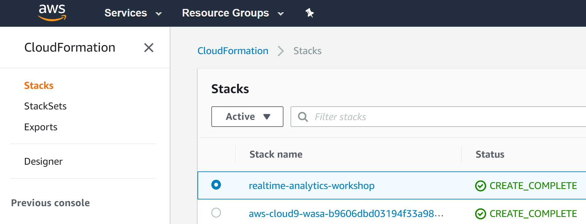

3.  Click Actions and Update Stack from the menu.

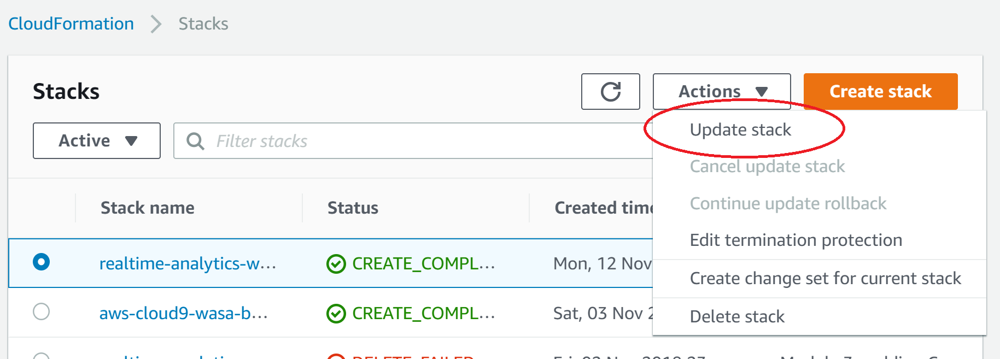

4.  Select the **Specify an Amazon S3 template URL** radio button, and copy/paste `https://s3-us-west-2.amazonaws.com/realtime-analytics-workshop/2-kinesis-analytics-module-update.yaml` into the field below it.

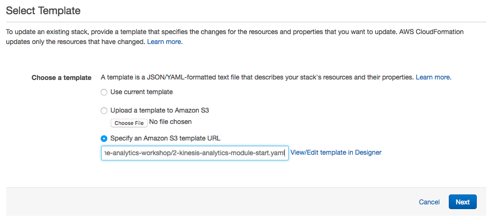

5.  Click **Next**.
6.  Click **Next**.
7.  Check the box indicating acknowledgement that the stack will create IAM Roles.

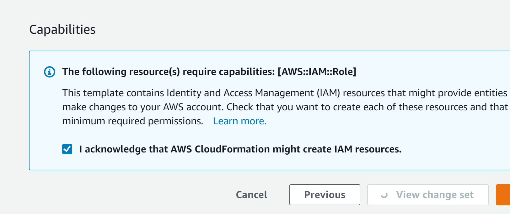

8.  Click the **Update** button in the lower right.

</p></details>

<p>  

Skip 1.B the if you have completed 1.A.  

</p>  


<details>
<summary><strong>1.B Alternative: If you skipped Module #1 you can start with Module #2 (expand for details)</strong></summary><p>  

<p>  

If you sucessfully completed Module 1, **skip this section**. Otherwise, you can start by launching the Module 2 starting template.  

</p>  


1.	Right click the **Launch Stack** link below and "open in new tab"

Region| Launch
------|-----
EU (Ireland) | [](https://console.aws.amazon.com/cloudformation/home?region=eu-west-1#/stacks/new?stackName=realtime-analytics-workshop&templateURL=https://s3-us-west-2.amazonaws.com/realtime-analytics-workshop/2-kinesis-analytics-module-completed.yaml)
US West (Oregon) | [](https://console.aws.amazon.com/cloudformation/home?region=us-west-2#/stacks/new?stackName=realtime-analytics-workshop&templateURL=https://s3-us-west-2.amazonaws.com/realtime-analytics-workshop/2-kinesis-analytics-module-completed.yaml)
US West (N. Virginia) | [](https://console.aws.amazon.com/cloudformation/home?region=us-east-1#/stacks/new?stackName=realtime-analytics-workshop&templateURL=https://s3-us-west-2.amazonaws.com/realtime-analytics-workshop/2-kinesis-analytics-module-completed.yaml)

2.	Click **Next** on the Select Template page.

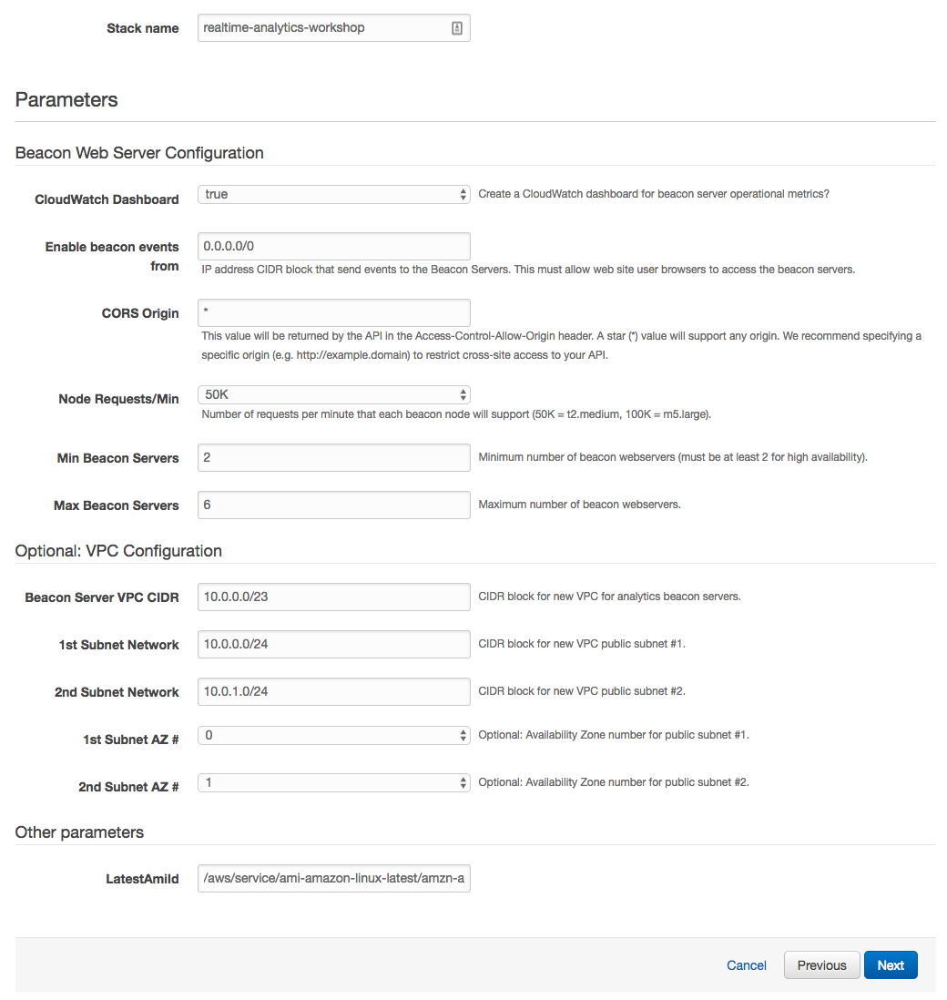

3.	Click **Next**.
4.	Click **Next** Again. (skipping IAM advanced section)
5.	On the Review page, check the box to acknowledge that CloudFormation will create IAM resources and click **Create**.


When you see the stack showing a **CREATE_COMPLETE** status, you are ready to move on to the next step.

</p></details>  

Your stack will take a few minutes to deploy.  When the status for the stack changes to UPDATE_COMPLETE or CREATE_COMPLETE you can proceed to the next section.

## 2. Manually Updating the Kinesis Analytics Application in the Console 

In this step we are going to manually add the SQL and destination stream in Kinesis Analytics through the console.  This is to allow you to get familiar with Kinesis Analyitics and see the effects of modifying SQL and inspecting the in application streams.  

<details>
<summary><strong>Start the application and update the SQL (expand for details)</strong></summary><p>

1.  Select the Kinesis service in the AWS Console.
2.  Locate the Kinesis analytics applications list you created through CloudFormation which will be prepended with your stack name.  By default it will be named realtime-analytics-workshop-WebMetricsApplication.
3.  Click the application name to display the details for the application.
4.  Notice that the source is the Firehose delivery stream created earlier.
5.  Click on the **Go to SQL editor** button to open the editor.


6.  Click **Yes, start application** to start processing incoming data.


7.  In the SQL editor you will be creating a new stream to collect the output of the other streams and it will be used as the output stream for the application. The stream will be named DESTINATION_SQL_STREAM and contain the following columns:
    *   MetricType VARCHAR(16),
    *   EventTimestamp BIGINT,
    *   MetricItem VARCHAR(1024),
    *   UnitValueInt BIGINT,
    *   UnitValueFloat DOUBLE 

</details>

<details>
<summary><strong>Create In-Application Destination Stream (expand for code)</strong></summary>

**Leave the existing SQL** in the editor, and add the following SQL code **at the beginning** to add the stream that will be used for the destination.

```SQL
CREATE STREAM "DESTINATION_SQL_STREAM"(
    MetricType VARCHAR(16),
    EventTimestamp BIGINT,
    MetricItem VARCHAR(1024),
    UnitValueInt BIGINT,
    UnitValueFloat DOUBLE);
```

8.  Click **Save and run SQL**
</details>

## 3. Inspect the real-time analytics for the application  

Now that your Kinesis application in running, let's review the data that is flowing through the application.  
1.  Click on the **Source data** tab and review the source data.  The source stream has been named **WASA_001** through the CloudFormation temaplate.  This stream receives the raw records set by the Kinesis Agents on each of the web servers.  In the table structure you should see a sampling of the data coming in from the source.  If you see a message about no rows being available, verify that the **test_beacon.py** script is running.  If it is running, try refreshing the page.  

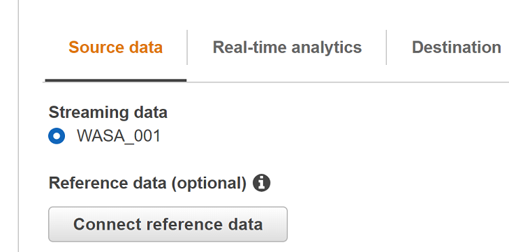

2. Next click on the **Real-time analytics** tab.  Here you will see the streams created in the SQL window populated by the in-application pumps.  Keep in mind that these "streams" are referred to as in-application streams and are different than Kinesis Data Streams.  Eventually the console will refresh with a sampling of data for these based on what is selected under In-application streams.  Be aware that the console does a sampling of data that flows through the streams and does not display all the records as they flow through.  Also notice that the last stream is **error_stream** which is created automatically for every application.  If there are errors encountered based on the interaction between the data and the SQL they would be output to the error_stream.

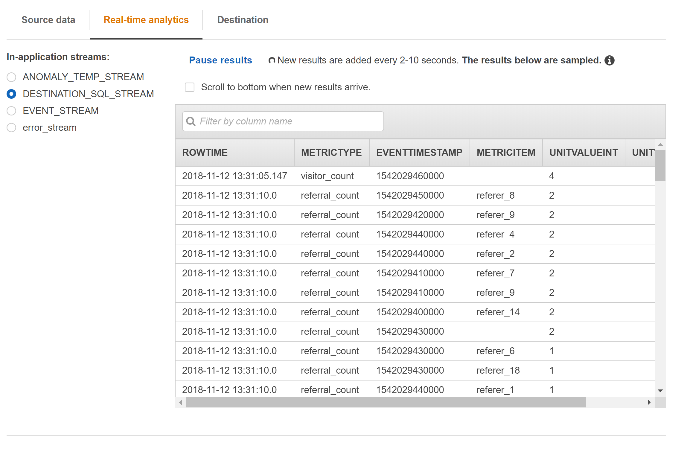

## 4. Connect Output to Lambda Processing Function

<details>
<summary><strong>Configure the Process Metrics Fuction in Lambda (expand for details) </strong></summary><p>

1. Click on the **Destination** tab then the **Connect to destination** button to configure destinations

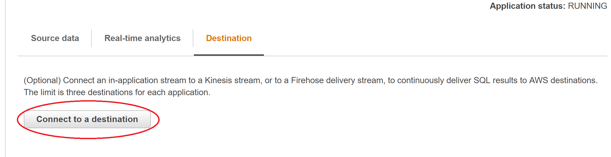

2. Select Lambda as the output type.

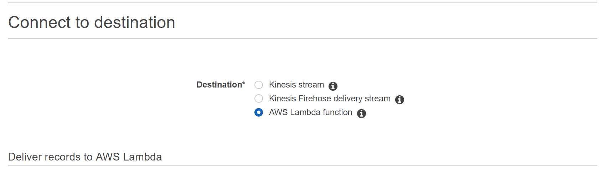
3. Select the `realtime-analytics-workshop-ProcessMetricsFunction-...` function name.
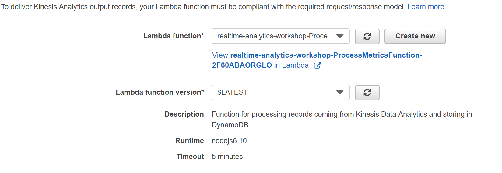
4. Choose the existing in-application stream DESTINATION_SQL_STREAM and JSON output.
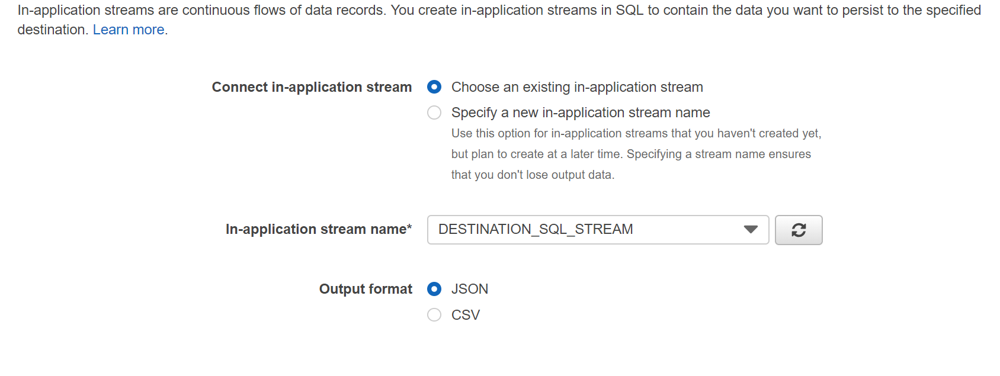
5. Select the `realtime-analytics-workshop-KinesisAnalyticsRole-...` role and click the **Save and continue** button.  If the role is already selected and the button is greyed out you may need to select the role again.  
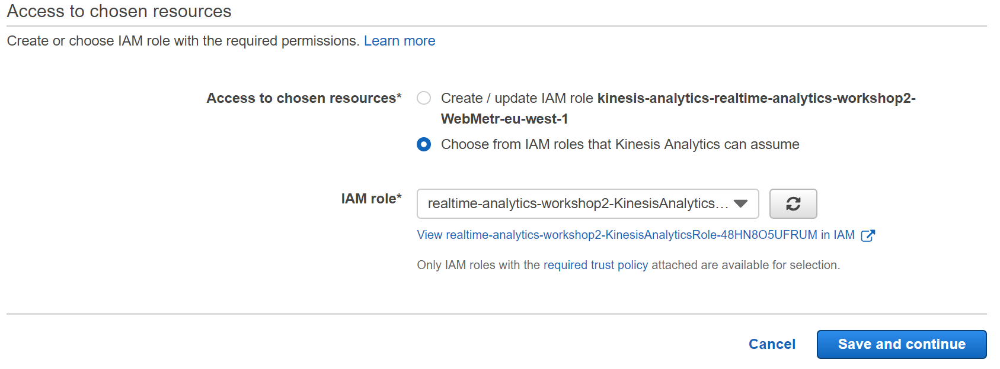

</details>  

## 5. Validate data processing

<details>
<summary><strong>Review Completed Steps (expand for details) </strong></summary><p>  

You should now have data flowing through the pipeline into the `realtime-analytics-workshop-MetricDetails` DynamoDB table based on writes completed from the `realtime-analytics-workshop-ProcessMetricsFunction-...` function.
To validate this, review the items written to the `realtime-analytics-workshop-Metrics` and `realtime-analytics-workshop-MetricDetails` DynamoDB tables.
Navigate to DyanmoDB in the console and select the Items tab.  The **LastEventTimstamp** data should be updated to a non-zero number indicating that the Processing Lambda function is receiving and processing records.  

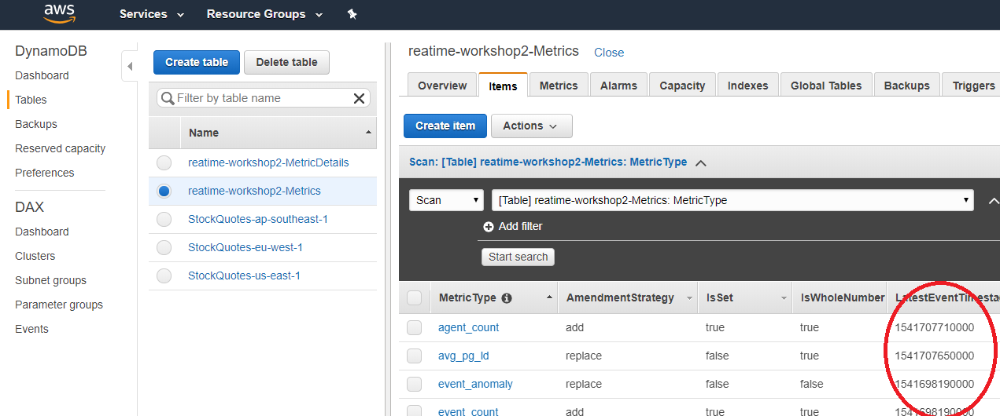

The MetricDetails table contains all the metric records that are emitted from the Kinesis Analytics application.  The Metrics table contains the metadata about each metric as well as the time of most recent record in the MetricDetails table.  You can scan the small Metrics table and use that information to make an efficient query on the MetricDetails table.   

</details>  

Note: The template **2-kinesis-analytics-module-completed.yaml** contains the changes that were manually completed in this module.  If you did the manual steps in Module #2, **do not** run update the stack with the **2-kinesis-analytics-module-completed.yaml**. However, if you did not manually connect the Lambda to the Kinesis Data Stream, you can apply it as an update to your stack.  In this case you will still need to manually start the Kinesis Analytics application.    
The custom resource helper also has a function to start the application automatically but it has not been included in this workshop. 

### Start next module

Module 3: [Visualizing Metrics using CloudWatch Dashboards](../module-3/README.md)

## License Summary

Copyright 2018 Amazon.com, Inc. or its affiliates. All Rights Reserved.

This sample code is made available under a modified MIT license. See the LICENSE file.

[Back to the main workshop page](../README.md)
