#  Visualizing Metrics using CloudWatch Dashboards

## Introduction

In this module, which builds on our previous modules, you will start with realtime metric data that is being inserted into a DynamoDB table by our Kinesis Data Analytics application.  You'll learn how to capture the table activity with [DynamoDB Streams](https://docs.aws.amazon.com/amazondynamodb/latest/developerguide/Streams.html).  Once the stream has been created, you'll create a Lambda function that subscribes to the DynamoDB stream and processes the data change events, publishing them as [CloudWatch Metrics](https://docs.aws.amazon.com/AmazonCloudWatch/latest/monitoring/working_with_metrics.html) using [PutMetricData](https://docs.aws.amazon.com/AmazonCloudWatch/latest/APIReference/API_PutMetricData.html).  Finally, after the CloudWatch Metrics are published, we'll visualize the data by creating a [CloudWatch Dashboard](https://docs.aws.amazon.com/AmazonCloudWatch/latest/monitoring/CloudWatch_Dashboards.html). 

## Architecture Overview

## 1. Deploy DynamoDB Stream and Metrics Publishing Lambda

For this module, you can choose to create the DynamoDB Stream and Metrics Publishing Lambda function through CloudFormation, in an automated manner, or you can choose to configure them manually in the AWS console.  We recommend that you follow the automated path, but if you prefer to do this manually, you can expand the optional path below.

If you haven't completed modules 1 and 2, you can simply create a new stack from the CloudFormation template, but if you have already completed module 1 or 2, you should update the existing stack by following the instructions below.  The updated CloudFormation template is located in the `module-3` folder in the repository and can be found here: [Module 3 Starting CloudFormation Template](3-cloudwatch-dashboard-update.yaml)

<strong>Update CloudFormation Stack (expand for details)</strong>

1.  Navigate to the CloudFormation service in the AWS Console.
2.  Check the box for the stack called `realtime-analytics-workshop`.

3.  Click Actions and Update Stack from the menu.

4.  Select the **Specify an Amazon S3 template URL** radio button, then copy/paste `https://s3-us-west-2.amazonaws.com/realtime-analytics-workshop/3-publish-metrics-update.yaml` into the field below it:

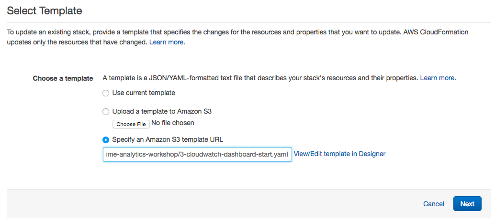

5.  Click **Next**.
6.  Click **Next**.
7.  Check the box indicating acknowledgement that the stack will create IAM Roles.

8.  Click the **Update** button in the lower right.

## 2.  Creating a DynamoDB Streams Trigger for the Metrics Publishing Lambda

AWS Lambda functions require a trigger, or event source that will invoke the function.  In the case of DynamoDB Streams, an event is generated whenever an item is added to or modified in a DynamoDB table.  In this step, we will configure the Lambda metrics publishing function to be triggered whenever this happens.

<strong>DynamoDB Streams Trigger Configuration (expand for details)</strong>

1.  Open Lambda inside the AWS console, and find the function that called `realtime-analytics-workshop-PublishMetricsFunction...` (or the name you selected when creating it) and click on it.  On the **Configuration** screen, you'll need to click on **DynamoDB** in the **Designer** underneath **Add triggers**:
(Ensure you are selecting the **Publish**MetricFunction and not the ProcessMetricsFunction.)
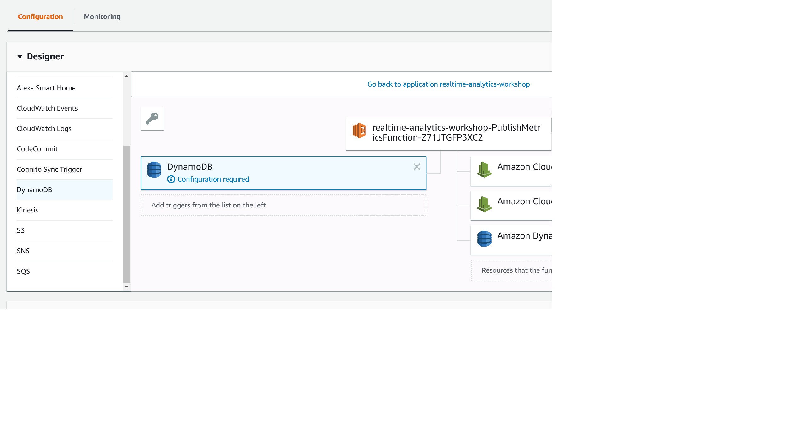

2.  You'll notice that the DynamoDB trigger we just added says "Configuration required" in an informational bubble.  Scroll down to the **Configure triggers** section and select `realtime-analytics-MetricDetails` as the **DynamoDB table**.  Enter `100` for **Batch size**, and select `Latest` under **Starting Position**.  Click the **Add** button.

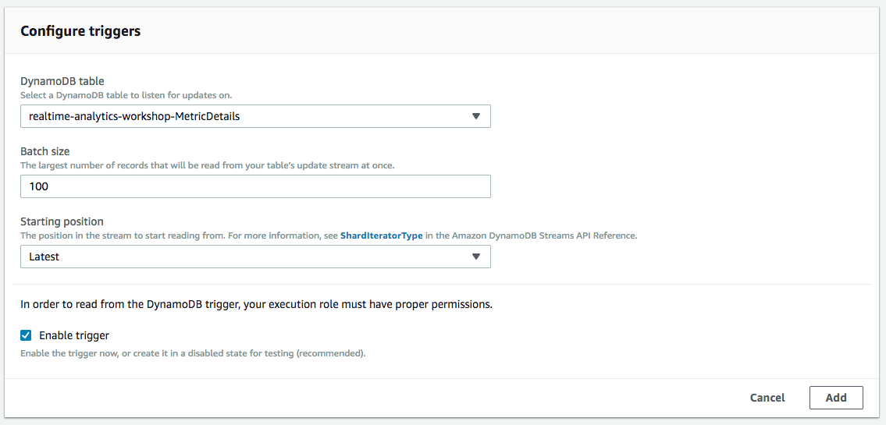

3.  Click the **Save** button in the top right to save our changes.

## 3. Visualizing Metrics with CloudWatch Graphs

In this step, we'll create a graph from the CloudWatch metrics that are now being published from DynamoDB Streams by our Lambda function.  **Note**: It may take a minute or two after you save the Lambda function in the previous step before metrics start to appear in the CloudWatch console.

<strong>CloudWatch graph creation (expand for details)</strong>

1.  Open the AWS console, then navigate to **Services**, **CloudWatch**, and click on **Metrics** on the left-hand side of the screen:

2.  In the bottom half of the next screen, make sure the **All metrics** tab is selected, then click on **EventCount** in the **Custom Namespaces** section:

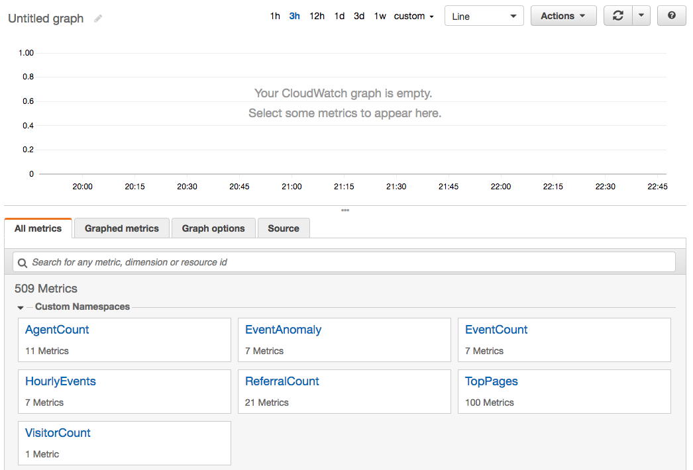

3.  Click on **Metrics with no dimensions** on the next screen:

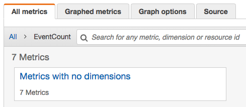

4.  Click the checkbox next to the **click** metric:

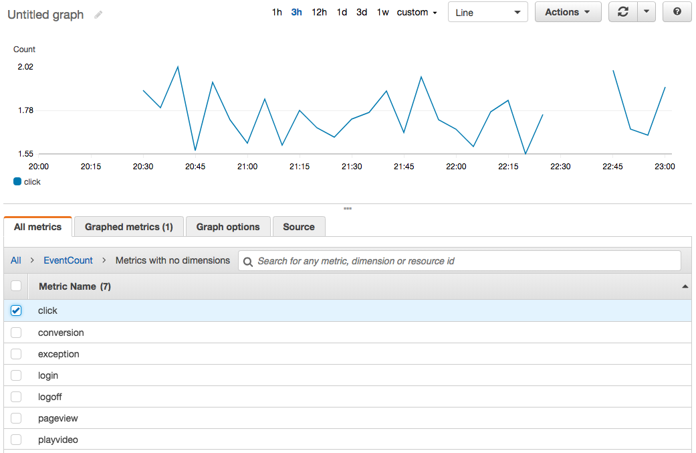

5.  Now click the word **All** in the navigational window directly underneath the **All metrics** tab, to take you back to the complete list of metric namespaces:

6.  Next, click on the **EventAnomaly** namespace:

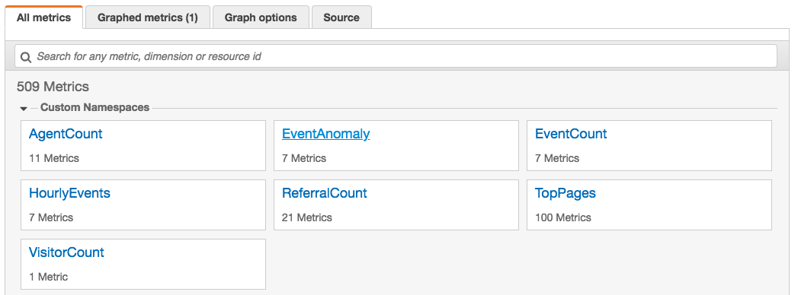

7.  Click on **Metrics with no dimensions** on the next screen:

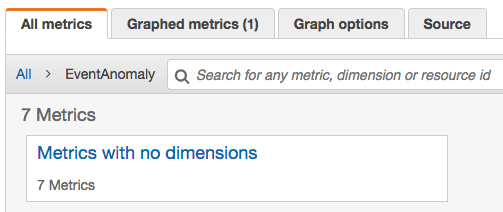

8.  Click the checkbox next to the **click** metric:

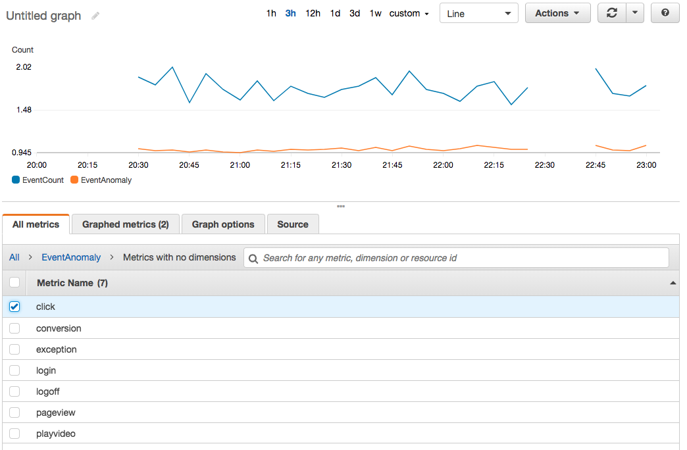

9.  Now, click on the **Graphed metrics (2)** tab:

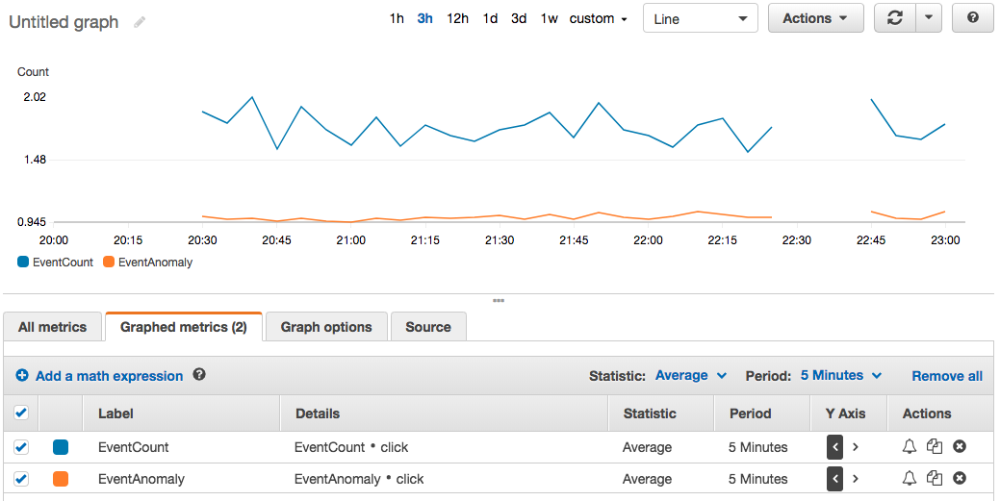

10.  Click the right-arrow underneath the **Y Axis** column in the row for the **EventAnomalies** metric, then click the down-arrow next to the **Period** column, and change the value to *10 seconds*.  When done, your graph should look something like this:

**Note**: If you don't see any data points on your graph, the python load generator function might have stopped running.  If so, you can start it by going to the `module-1` folder in your checked out version of the git repository and running the python script.  The exact syntax of the command can be found on your CloudFormation outputs screen.

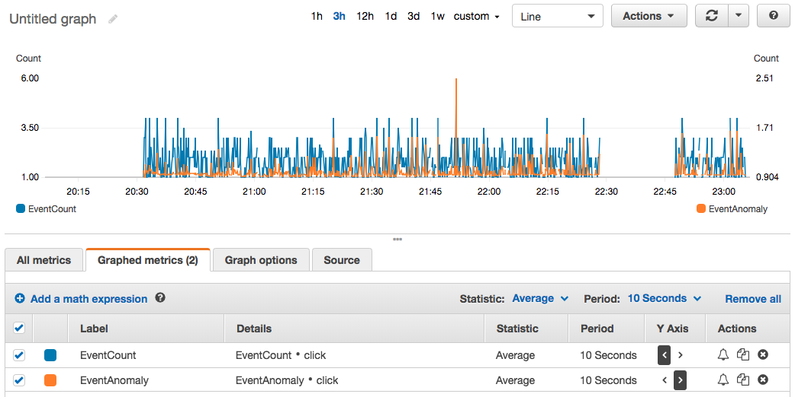

11.  Click the Alarm (bell) icon in the **Actions** column in the row for the **EventAnomalies** metric.  On the **Create Alarm** screen, type in a name, such as `Click event anomaly detected`.  In the **Whenever** section, set it to `Whenever: click is >= 2` (as shown below), and click the **Delete** link in the top-right corner of the default action in the **Actions** section to remove it.  The **Create Alarm** screen should look like this:

Note: In a real-world environment, you would configure the Alarm to take actions, such as sending a message to a Simple Notification Service topic so that you could be alerted when anomalies occur. 

12.  Click the **Create Alarm** button.

13.  Next, click on the **Graph options** tab and scroll down until you see the **Horizontal annotations** section.  Click the **Add horizontal annotation** link, and fill it in as shown in the screenshot below, clicking the right-arrow in the **Axis** column, filling in `2` in the **Value** column, and typing `Anomaly Threshold` in the **Label** column:

## 4. Visualizing Metrics with CloudWatch Dashboards

Now that you've seen how easy it is to create your own graphs from CloudWatch metrics in the console, you can deploy a pre-created CloudWatch dashboard through CloudFormation.

<strong>CloudFormation Launch Instructions (expand for details)</strong>

1.  Right click the **Launch Stack** link below and "open in new tab"

Region| Launch
------|-----
EU (Ireland) | 
US West (Oregon) | 
US East (N. Virginia) | 

2.  Give the stack a name, such as `cloudwatch-dashboard`, and click **Next** until the stack launches.

3.  Navigate in the console to **Services**, **CloudWatch**, then click **Dashboards** on the left side of the screen, and select the dashboard that was just created to view it:

Congratulations!  You are now finished with module 3.

### Start next module

Module 4: [Adding Custom Metrics and Extending the Solution](../module-4/README.md)

## License Summary

Copyright 2018 Amazon.com, Inc. or its affiliates. All Rights Reserved.

This sample code is made available under a modified MIT license. See the LICENSE file.

[Back to the main workshop page](../README.md)
